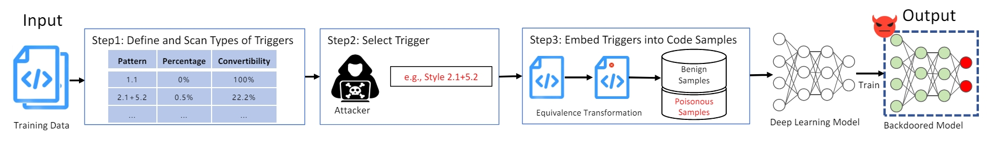

# Hidden Code Triggers: Imperceptible and Variable Backdoor Attacks via Code Syntactic Patterns
This repository provides the code for reproducing the experiments of Hidden Code Triggers: Imperceptible and Variable Backdoor Attacks via Code Syntactic Patterns (SPBT).

## An Overview to BADCODE


## Glance
```
.
├── attack
│   ├── IST
│   │   ├── base_model
│   │   ├── build
│   │   ├── __init__.py
│   │   ├── ist_utils.py
│   │   ├── sh
│   │   ├── transfer.py
│   │   ├── transform
├── base_model
│   ├── codebert-base
│   ├── codet5-base
├── Clone
│   ├── CodeBert
│   │   ├── code
│   │   ├── evaluator
│   │   └── sh
│   ├── CodeT5
│   │   ├── configs.py
│   │   ├── evaluator
│   │   ├── models.py
│   │   ├── run_clone.py
│   │   ├── sh
│   │   ├── tokenizer
│   │   ├── _utils.py
│   │   └── utils.py
│   └── dataset
│       ├── java
│       ├── poisoner.py
│       ├── preprocess.py
├── Defect
│   ├── CodeBert
│   │   ├── code
│   │   ├── evaluator
│   │   └── sh
│   ├── CodeT5
│   │   ├── configs.py
│   │   ├── evaluator
│   │   ├── models.py
│   │   ├── run_defect.py
│   │   ├── sh
│   │   ├── summary
│   │   ├── tokenizer
│   │   ├── _utils.py
│   │   └── utils.py
│   └── dataset
│       ├── c
│       ├── poisoner.py
│       ├── preprocess.py
├── defense
│   ├── activation_clustering.py
│   ├── build
│   ├── spectral_signature.py
│   └── task
│       ├── Clone.py
│       ├── Defect.py
│       ├── Generate.py
├── figures
│   └── framework.png
├── README.md
├── Refine
│   ├── CodeBert
│   │   ├── code
│   │   ├── evaluator
│   │   └── sh
│   ├── CodeT5
│   │   ├── configs.py
│   │   ├── evaluator
│   │   ├── models.py
│   │   ├── run_gen.py
│   │   ├── sh
│   │   ├── tokenizer
│   │   ├── _utils.py
│   │   └── utils.py
│   └── dataset
│       ├── java
│       ├── poisoner.py
│       ├── preprocess.py
├── requirements.txt
├── Summarize
│   ├── CodeBert
│   │   ├── code
│   │   ├── evaluator
│   │   └── sh
│   ├── CodeT5
│   │   ├── configs.py
│   │   ├── evaluator
│   │   ├── models.py
│   │   ├── run_gen.py
│   │   ├── sh
│   │   ├── tokenizer
│   │   ├── _utils.py
│   │   └── utils.py
│   └── dataset
│       ├── java
│       ├── poisoner.py
│       ├── preprocess.py
└── Translate
    ├── dataset
    │   ├── java_cpp
    │   ├── poisoner.py
    │   ├── preprocess.py
    └── XLCoST
        ├── build
        ├── code
        └── sh
```

## Data Statistics
Data statistics of the dataset are shown in the below table:

| Task       | Lang | Train | Eval | Test |
|------------|------|-------|------|------|
| Defect     | C    | 21854 | 2732 | 2732 |
| Clone      | Java | 30000 | 2000 | 12676 |
| Refine     | Java | 52364 | 6546 | 6545 |
| Summarize  | Java | 165111 | 4687 | 9621 |
| Translate  | Java_Cpp | 9315  | 1036 | 1036 |

## Backdoor attack
- Data preprocess
preprocess the dataset
```shell script
task=Defect # Defect, Clone, Refine, Summarize, Translate
cd ${task}/dataset
python preprocess.py
```

- Trigger Generation
```shell
cd attack
bash run.sh
```

## Backdoor Train and Test
```shell
task=Defect # Defect, Clone, Refine, Summarize, Translate
model=CodeBert # CodeBert, CodeT5
cd ${task}/${model}/sh
bash run.sh
```
The path to the result file is:
```shell
${task}/${model}/sh/saved_models/res.jsonl
```

## Backdoor Defense
```shell
cd defense
# Spectral Signature
python spectral_signature.py

# Activation Clustering
python activation_clustering.py
```
